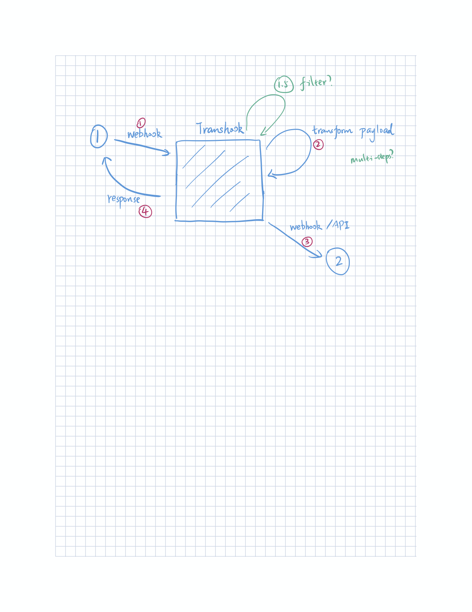

# Transhook

Connecting Internet services by transforming data between Webhooks.

```
Service A -> Transhook -> Service B
```



## Development

To start your Phoenix server:

- Setup the project with `mix setup`
- Start Phoenix endpoint with `mix phx.server`

Now you can visit [`localhost:4000`](http://localhost:4000) from your browser.

## Deployment

[](https://heroku.com/deploy?template=https://github.com/linjunpop/transhook)
